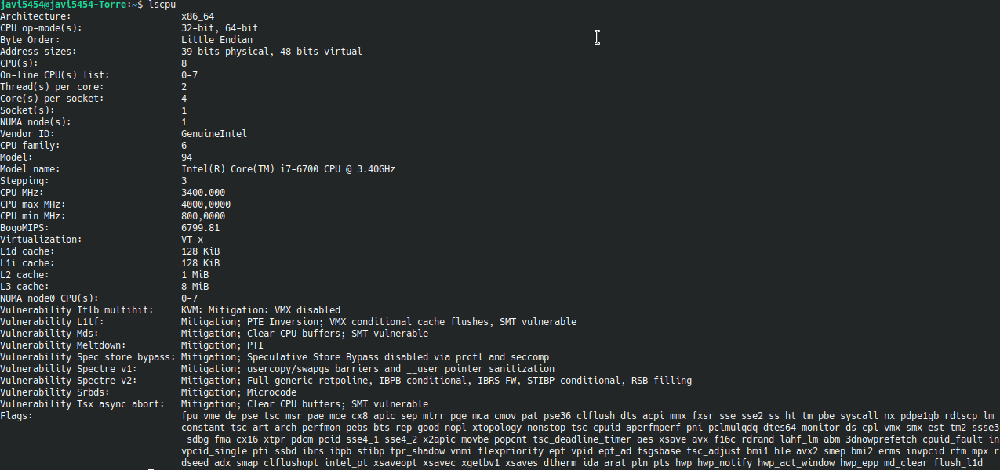
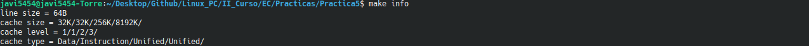
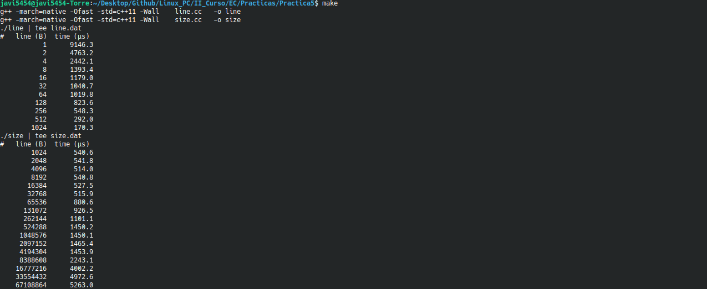
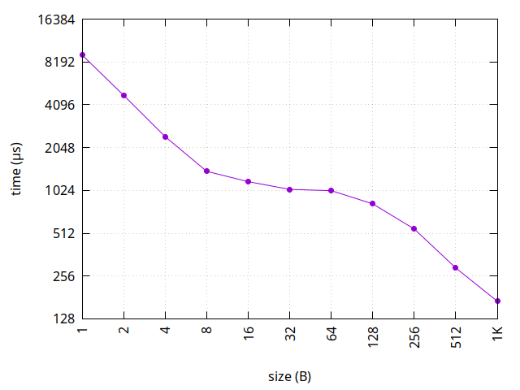
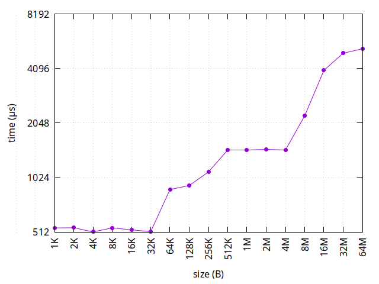

# :four: Memoria caché

> Alumno: Javier Gómez López \<<javi5454@correo.ugr.es>\>
>
> Fecha: 15 de diciembre, 2021
>
> Curso: 2º Doble Grado en Ingeniería Informática y Matemáticas, 2021/2022

## ¿Qué es la memoria _caché_?

La memoria _caché_ es uno de los recursos con los que cuenta la CPU para almacenar temporalmente datos procesados en una memoria auxiliar. Se trata de lo que se conoce como una memoria estática de acceso aleatorio muy rápida y colocada cerca de la CPU.

La principal función de esta memoria es almacenar datos o instrucciones que la CPU va a necesitar en un futuro inmmediato, mejorando el rendimiento y velocidad de la misma en la ejecución de tareas cotidianas.

## Modificiación del código

### `line.cc`

La modificación del archivo `line.cc` es extremadamente sencilla; basta con completar el bucle `for` que está incompleto con la instrucción `bytes[i]++`. Así, el código quedaría de la siguiente manera:

~~~cpp
#include <algorithm>    // nth_element
#include <array>        // array
#include <chrono>       // high_resolution_clock
#include <iomanip>      // setw
#include <iostream>     // cout
#include <vector>       // vector

using namespace std::chrono;

const unsigned MAXLINE = 1024; // maximun line size to test
const unsigned GAP = 12;       // gap for cout columns
const unsigned REP = 100;      // number of repetitions of every test

int main()
{
	std::cout << "#" 
	          << std::setw(GAP - 1) << "line (B)"
	          << std::setw(GAP    ) << "time (µs)"
	          << std::endl;

	for (unsigned line = 1; line <= MAXLINE; line <<= 1) // line in bytes
	{
		std::vector<duration<double, std::micro>> score(REP);

		for (auto &s: score)
		{
			std::vector<char> bytes(1 << 24); // 16MB

			auto start = high_resolution_clock::now();

			for (unsigned i = 0; i < bytes.size(); i += line)
				bytes[i]++;

			auto stop = high_resolution_clock::now();

			s = stop - start;
		}

		std::nth_element(score.begin(), 
		                 score.begin() + score.size() / 2, 
		                 score.end());

		std::cout << std::setw(GAP) << line
		          << std::setw(GAP) << std::fixed << std::setprecision(1)
		          << std::setw(GAP) << score[score.size() / 2].count()
		          << std::endl;
	}
}
~~~

Para saber el tamaño de línea de nuestra caché debemos realizar un incremento en el que se raliza una función XOR. Como se nos indica en el guión de la práctica, el bucle `for` debe de ser sencillo, para que no afecte de manera notable a los resultados obtenidos.

Cabe destacar que las CPU actuales no acceden a memoria byte a byte, si no que obtienen la memoria en fragmentos. En el caso de mi CPU estos fragmentos son de 64 bits.

### `size.cc`

En este caso, la modificación es algo más sofisticada. Consiste en completar el bucle `for` que se indica con la línea `bytes[(i* 64)&(size-1)]++`. En este caso se va a ir incrementando el vector de bytes conforme avance el bucle `for`. Tomamos el valor `(size-1)` y no el valor `size` para evitar salir del vector y acceder a posiciones de memoria no deseables.

~~~cpp
#include <algorithm>    // nth_element
#include <array>        // array
#include <chrono>       // high_resolution_clock
#include <iomanip>      // setw
#include <iostream>     // cout
#include <vector>       // vector

using namespace std::chrono;

const unsigned MINSIZE = 1 << 10; // minimun line size to test:  1KB
const unsigned MAXSIZE = 1 << 26; // maximun line size to test: 32MB
const unsigned GAP = 12;          // gap for cout columns
const unsigned REP = 100;         // number of repetitions of every test
const unsigned STEPS = 1e6;       // steps

int main()
{
	std::cout << "#" 
	          << std::setw(GAP - 1) << "line (B)"
	          << std::setw(GAP    ) << "time (µs)"
	          << std::endl;

	for (unsigned size = MINSIZE; size <= MAXSIZE; size *= 2)
	{
		std::vector<duration<double, std::micro>> score(REP);

		for (auto &s: score)
		{
			std::vector<char> bytes(size);

			auto start = high_resolution_clock::now();

			for (unsigned i = 0; i < STEPS; ++i)
				bytes[(i*64)&(size-1)]++;

			auto stop = high_resolution_clock::now();

			s = stop - start;
		}

		std::nth_element(score.begin(), 
		                 score.begin() + score.size() / 2, 
		                 score.end());

		std::cout << std::setw(GAP) << size
		          << std::setw(GAP) << std::fixed << std::setprecision(1)
		          << std::setw(GAP) << score[score.size() / 2].count()
		          << std::endl;
	}
}
~~~

Actualmente, en los procesadores de la memoria caché encontramos varios nivels:
- __L1__: es la memoria caché más rapida y pequeña. Aquí se almacenan los datos de uso más frecuente. Su tamaño habitual es de 256 KB.
- __L2__: Es algo más lenta y grande que L1, y su capacidad oscila entre los 256 KB y los 8 MB.
- __L3__: Es la más lenta y grande de las tres. Su capacidad va desde los 4 MB hasta los 50 MB.

Como los niveles de la caché ocurre algo parecido que al caso anterior, se van almecenando valores en un vector modicando cada línea de cache de forma que cuando alcanzamos el último valor volvemos al inicio.
Así, los niveles de caché se harán viisibles cuando el rendimiento de la caché experimente saltos, es decir, los tamaños del vector donde se derrama un nivel de caché.

## Información a través de la terminal

Primero, checkeamos el tipo y el modelo de procesador de nuestro ordenador.

Ahora, ejecutamos el comando `make info`para ejecutar nuestros programas:

Podemos observar que ambas informaciones coinciden.

Tras esto, ejecutamos nuestros dos programas a través del comando `make`:

De esta manera, ya hemos generado los resultados para nuestro ejercicio.

## Análisis de resultados

### Tamaño de línea

Los resultados obtenidos al ejecutar `line.cc` son los siguientes:
| Line (B) | Time (µs) |
|----------|-----------|
| 1        | 9146.3    |
| 2        | 4763.2    |
| 4        | 2442.1    |
| 8        | 1393.4    |
| 16       | 1179.0    |
| 32       | 1040.7    |
| 64       | 1019.8    |
| 128      | 823.6     |
| 256      | 548.3     |
| 512      | 292.0     |
| 1024     | 170.3     |

Y la gráfica generada es:

Como podemos observar en la gráfica, cuando el tamaño es de 64B, la línea de la gráfica realiza una progresiva bajada, lo que verifica que el tamaño de línea de 64B.

Además, en esta gráfica en cada iteración del bucle se debería de ir reduciendo a la mitad el tiempo de acceso a memoria, generando una gráfica de comportamiento lineal. Pero observamos que cuando el tamaño de dato es 8B, el comportamiento deja de ser lineal y comenzamos a estancarnos en la reducción de tiempo. Esto se debe a que, aunque siempre tengamos el mismo número de fallos, el número de aciertos va disminuyendo porque en cada vuelta se coge menos datos del bloque que nos hemos traído de memoria.

Sin embargo, cuando el tamaño llega a los 64B, se observa de nuevo un comportamiento lineal, esto es debido a que el número de aciertos es nulo, con lo cual son todo fallos. Estos fallos provocan la forma lineal, puesto que siempre va a dar error, siempre tarda lo mismo en acceder a memoria a partir de los 64B.

### Tamaño de la caché 

Los resultados obtenidos al ejecutar `size.cc` son los siguientes:
| line (B) | time (µs) |
|:--------:|:---------:|
|   1024   |   540.6   |
|   2048   |   541.8   |
| 4096     | 514.0     |
| 8192     | 540.8     |
| 16384    | 527.5     |
| 32768    | 515.9     |
| 65536    | 880.6     |
| 131072   | 926.5     |
| 262144   | 1101.1    |
| 524288   | 1450.2    |
| 1048576  | 1450.1    |
| 2097152  | 1465.4    |
| 4194304  | 1453.9    |
| 16777216 | 4002.2 |
| 33554432 | 4972.6 |
| 67108864 | 5263.0 |

Y la gráfica generada es:

De aquí podemos extraer varias conclusiones:
- En 64KB hay un salto importante, por lo que la caché L1 es de 64KB.
- Entre 64KB y 512KB hay otro crecimiento, en el cual hay un salto en 256 KB, lo que indica que la caché L2 es de 256KB.
- Posteriormente, se observa un crecimiento muy pronunciado entre 4M y 16M lo que indica que la caché L3 es de 8M.

Por tanto, observamos que el acceso a memoria es más lento segñun incrementamos de nivel.